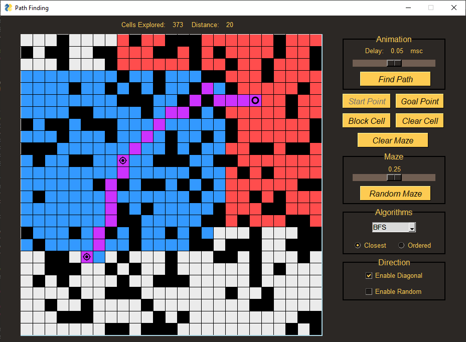

Path Finding
======

A small application that shows how the most popular search algorithms work.
It's written in Python using Pygame and PySimpleGUI.
The user can play with several options:
* choice of algorithm
* creating a maze
* setting search directions
* choosing the search order
* animation speed

### That's how it looks.

### Libraries
To run you need these libraries:
* PySimpleGui
* PyGame

## Feel Free To Download and Change Code
